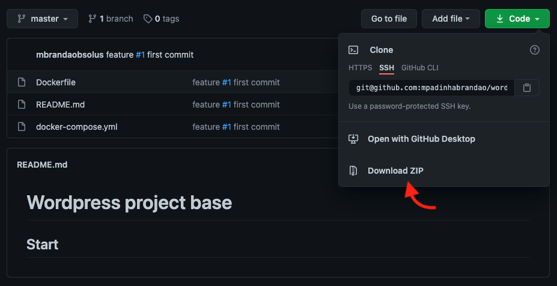

# Wordpress project base

## Tools and Stack

- [Git](https://git-scm.com)
- [Docker](https://www.docker.com)
- [Docker-compose](https://docs.docker.com/compose/)
- [Visual code](https://code.visualstudio.com)
- [PHP 7](https://www.php.net)
- [MySQL 5.7](https://dev.mysql.com)
- [PHPMyAdmin](https://www.phpmyadmin.net/)
- [Wordpress](https://wordpress.org)
- [Wordpress CLI](https://developer.wordpress.org/cli/commands/)
- [Markdown Cheatsheet](https://github.com/adam-p/markdown-here/wiki/Markdown-Cheatsheet)
- [Github](https://github.com/)

## Prepare your machine

Install: git, docker, docker-compose and Visual Code

## Download

Go to [Github repository](https://github.com/mpadinhabrandao/wordpress-init) and download the code, extract zip content and go to extracted directory.

You should do download and not git clone.



Or

```bash
wget "https://github.com/mpadinhabrandao/wordpress-init/archive/master.zip" -O wps.zip
unzip wps.zip
cd ./wordpress-init-master/
code . # code command open visual code on <.> directory
```

## Configurations

```htaccess
php_value upload_max_filesize 64M 
php_value post_max_size 64M 
php_value max_execution_time 300 
php_value max_input_time 300
```

## use WP cli

```bash
docker-compose run --rm cli core update
docker-compose run --rm cli plugin update --all
docker-compose run --rm cli plugin install woocommerce --activate
docker-compose run --rm cli theme install /var/www/html/theme.zip --activate
docker-compose run --rm cli theme install /var/www/html/theme-child.zip --activate
docker-compose run --rm cli plugin install contact-form-7 --activate

docker-compose run --rm cli theme install storefront --activate
docker-compose run --rm cli theme update storefront
```
